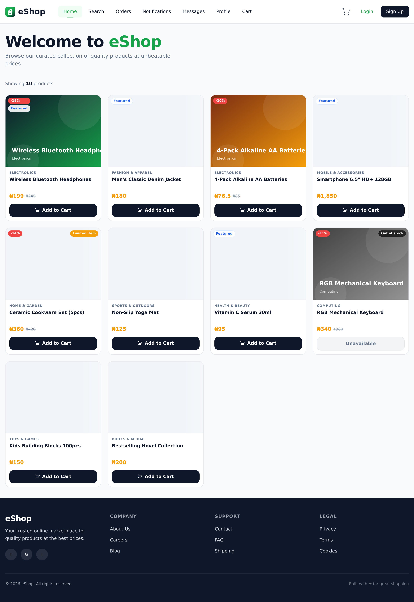
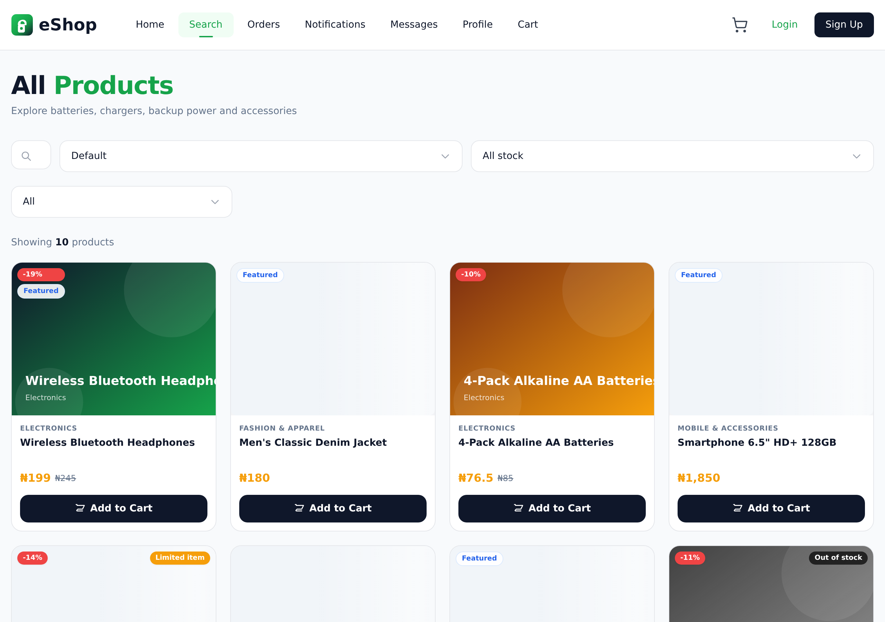
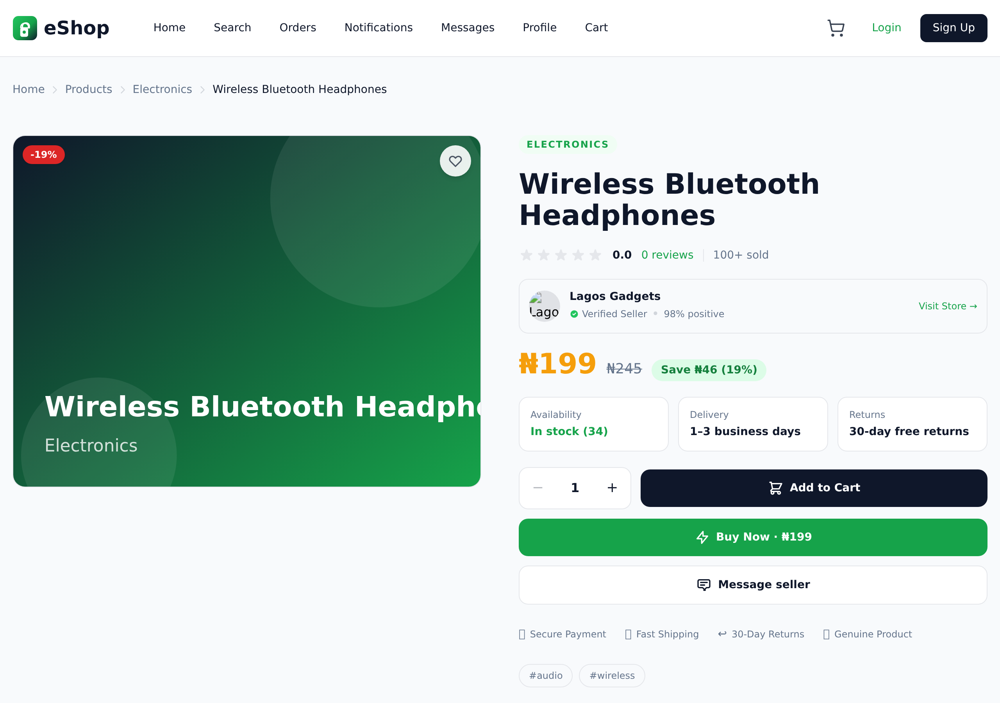
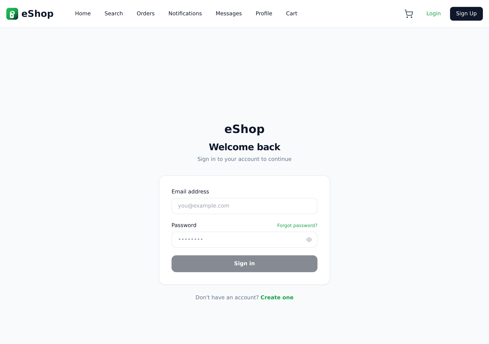
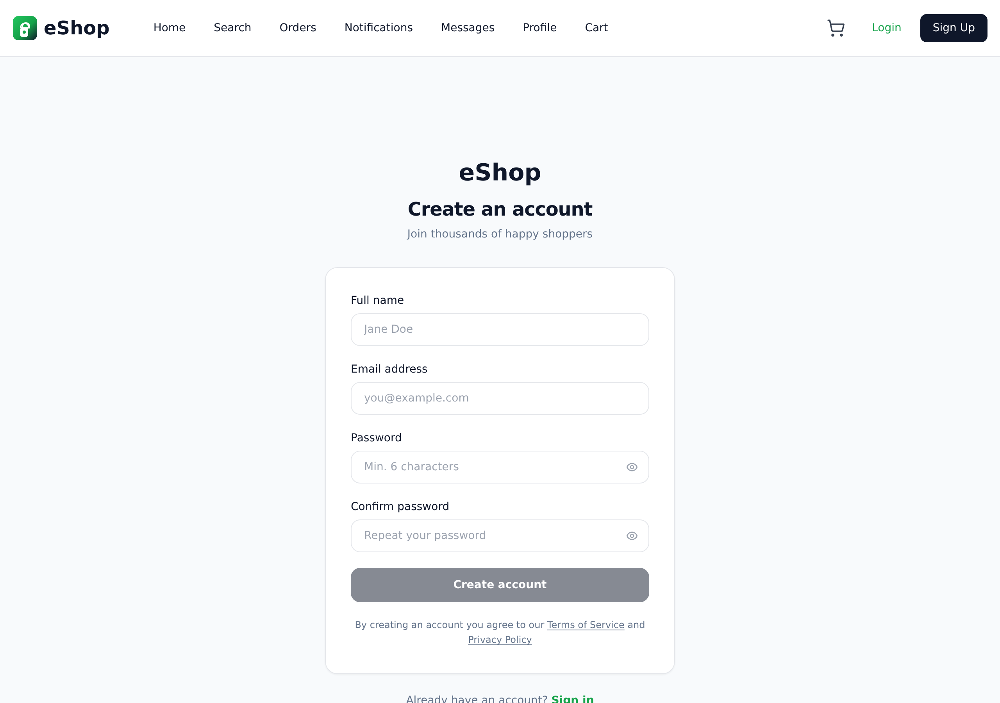
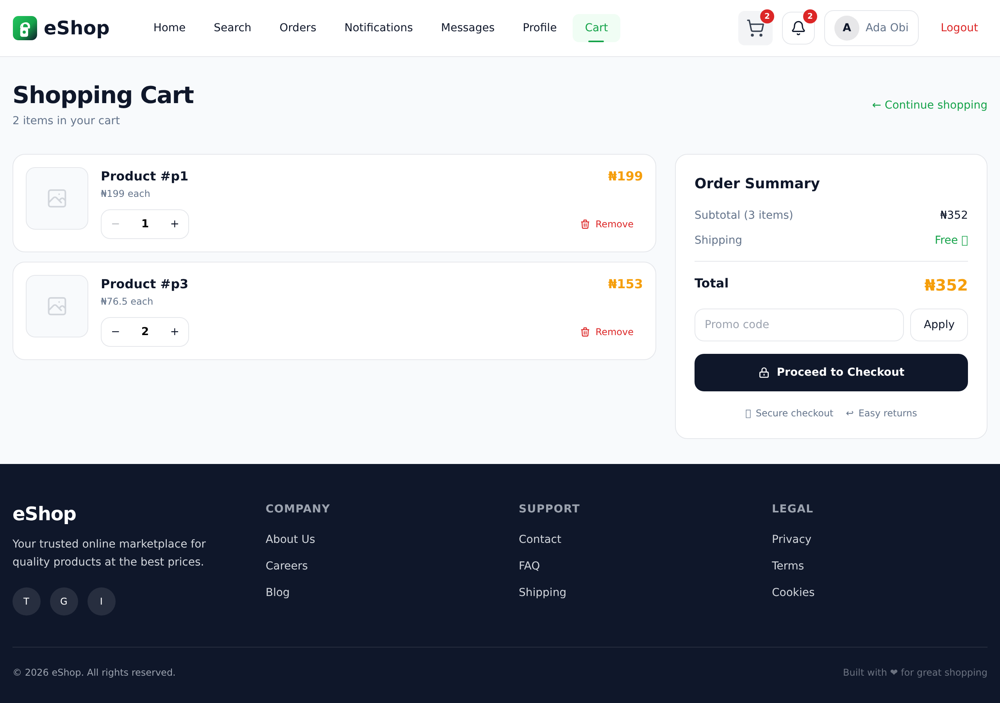
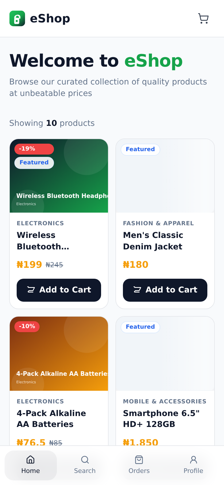
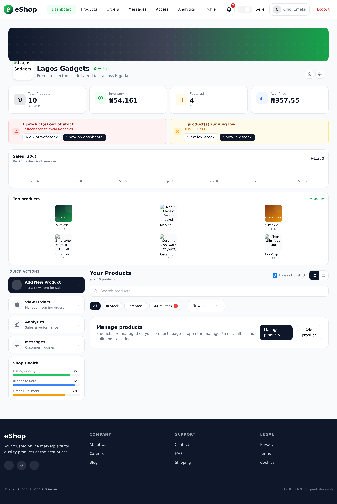
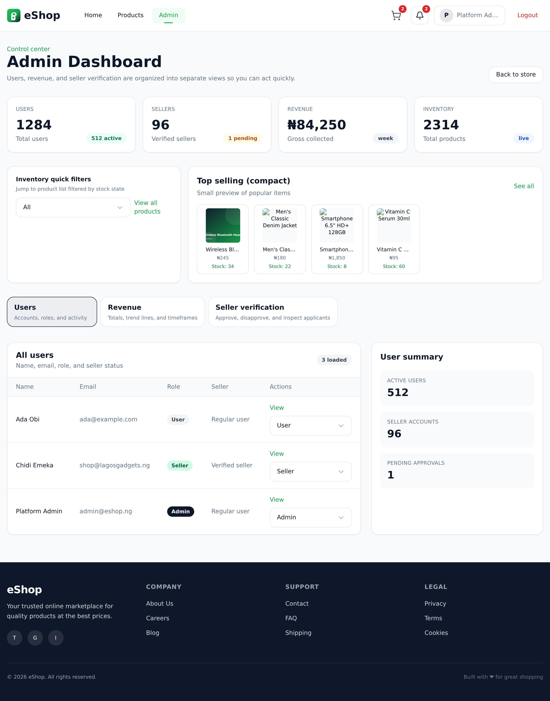

<p align="center">
  
</p>

<h1 align="center">eShop — Multi-Vendor E-Commerce Marketplace</h1>

<p align="center">
  A full-stack, multi-vendor marketplace built for Nigerian shoppers and sellers first (₦ / kobo pricing), with global scalability in mind.
</p>

<p align="center">
  
  
  
  
  
  
  
  
</p>

---

## Table of contents

1. [What is eShop?](#what-is-eshop)
2. [Who is it for?](#who-is-it-for)
3. [Screenshots](#screenshots)
4. [Key features](#key-features)
5. [Technology stack](#technology-stack)
6. [Architecture](#architecture)
7. [Project structure](#project-structure)
8. [How it works — frontend](#how-it-works--frontend)
9. [How it works — backend](#how-it-works--backend)
10. [Data model (Firestore)](#data-model-firestore)
11. [Roles & permissions](#roles--permissions)
12. [API reference](#api-reference)
13. [Prices & currency](#prices--currency)
14. [Getting started](#getting-started)
15. [Environment variables](#environment-variables)
16. [Available scripts](#available-scripts)
17. [Capturing screenshots (Playwright)](#capturing-screenshots-playwright)
18. [Deployment](#deployment)
19. [Security](#security)
20. [Known limitations & roadmap](#known-limitations--roadmap)
21. [License](#license)

---

## What is eShop?

**eShop** is a production-structured **multi-vendor marketplace** (think a mini Jumia / Konga). Anyone can browse and buy; approved vendors can open their own shop, list products, manage inventory, and track orders — while platform admins oversee users, sellers, and revenue from a central dashboard.

It is a **frontend + backend** project:

- **Frontend** — a single-page app (React + Vite + TypeScript + Tailwind CSS) that talks to the backend exclusively over a REST API.
- **Backend** — a REST API (Node.js + Express + TypeScript) backed by **Firebase** (Firestore for data, Firebase Auth for accounts), with **Paystack** payments, **Brevo** email, and **FCM** push notifications.

The business is **Nigeria-first**: prices are stored and calculated in **kobo** (₦1 = 100 kobo) to avoid floating-point rounding, but the currency layer supports **NGN, USD, GBP and EUR**.

> The frontend lives at the **repository root** (not a `frontend/` folder) and the backend lives in [`backend/`](backend/).

---

## Who is it for?

| Audience | What they get |
| --- | --- |
| **Shoppers (buyers)** | Browse, search and filter products; cart; address book; Paystack checkout; order history and live order tracking; in-app + push notifications; chat with sellers. |
| **Sellers / vendors** | Apply to become a seller; a shop dashboard with stats; product CRUD (multi-image via ImgBB); inventory/low-stock alerts; order management with stage-by-stage fulfilment; sales analytics; team (employee) access management; buyer messaging. |
| **Platform admins** | Approve/reject seller applications; manage user roles; revenue analytics (today/week/month); user and order oversight. |
| **Developers** | A clean, type-safe TypeScript codebase with a modular service architecture, an abstracted payment layer, and RBAC — a solid starting point for a real marketplace. |

---

## Screenshots

> Captured with Playwright against the dev server using mocked API responses (no Firebase/Paystack keys required — see [Capturing screenshots](#capturing-screenshots-playwright)).

**Storefront**

| Home | Product catalogue |
| --- | --- |
|  |  |

| Product detail | Login | Sign up |
| --- | --- | --- |
|  |  |  |

| Cart | Mobile home |
| --- | --- |
|  |  |

**Seller & admin**

| Seller dashboard | Admin dashboard |
| --- | --- |
|  |  |

---

## Key features

### For buyers
- Product catalogue with **pagination, category filtering, search, sorting, and stock filters**.
- **Product detail** page with image gallery, features/specs tabs, related products, and a "contact seller" flow.
- Persistent **shopping cart** (Zustand store, synced to the backend when logged in).
- **Address book** management (add / edit / delete / default).
- **Checkout** → order creation → **Paystack** payment → order tracking.
- Order **fulfilment timeline**: `Noted → Processing → In transit → Completed`.
- **In-app notifications** (with unread badge) and **FCM push** for important events.
- **Direct messaging** with sellers (general / product / order contexts).
- Profile management and **apply-to-sell** flow.

### For sellers
- **Seller application** and admin approval workflow.
- **Shop dashboard** with stats (products, inventory value, featured, average price), low/out-of-stock alerts, and a sales preview.
- **Product management** (create/edit/delete, grid/list views, multi-image uploads via ImgBB, tags, features, specs, sale pricing/discounts).
- **Seller analytics** — revenue, units sold, top products, inventory status (7/30/90 day ranges).
- **Order management** with stage-by-stage advancement and search.
- **Employee / access management** with role templates (`cashier`, `sales_rep`, `support_agent`, `operations_manager`, or custom permissions).
- Email alerts for new orders (Brevo).

### For admins
- **Overview**: users, active users, seller count, revenue (total / today / week / month) and a 7-day revenue timeline.
- **Revenue analytics** by day/week/month.
- **Seller verification**: approve or reject applications.
- **Role management**: set a user's role (`admin` / `moderator` / `seller` / `user`).

---

## Technology stack

### Frontend (repository root)

| Concern | Technology |
| --- | --- |
| UI framework | React 18 |
| Language | TypeScript 5 |
| Build tool | Vite 5 |
| Styling | Tailwind CSS 3 (+ custom animations) |
| State management | Zustand |
| Routing | React Router 6 |
| HTTP client | Axios (with auth interceptors) |
| Charts | Recharts |
| Icons | lucide-react |
| Push messaging | Firebase Web SDK (FCM only) |
| Image uploads | ImgBB API |

### Backend ([`backend/`](backend/))

| Concern | Technology |
| --- | --- |
| Runtime | Node.js 16+ |
| Framework | Express 4 |
| Language | TypeScript 5 |
| Dev runner | tsx (`tsx watch`) |
| Database | Firestore (Firebase Admin SDK) |
| Auth | Firebase Auth + JWT (jsonwebtoken) |
| Password hashing | bcryptjs |
| Payments | Paystack (abstracted provider layer; Stripe & Flutterwave scaffolds) |
| Email | Brevo (Sendinblue) |
| Push | Firebase Cloud Messaging |
| Validation | Hand-rolled input checks in routes |

---

## Architecture

```
┌──────────────────────────────────────────────────────────┐
│                    FRONTEND (Vite SPA)                   │
│     React 18 · TypeScript · Tailwind · Zustand           │
│     Runs on http://localhost:5173  (repo root)           │
└───────────────────────────┬──────────────────────────────┘
                            │  HTTPS / REST (JSON)
                            │  /api/*  (Vite dev proxy → :5000)
┌───────────────────────────▼──────────────────────────────┐
│                   BACKEND (Express API)                  │
│    Node.js · TypeScript · Express · Firebase Admin       │
│    Runs on http://localhost:5000  (backend/ directory)   │
│                                                          │
│   middlewares → routes → services → Firestore            │
│        │            │           │                        │
│   rate-limit    auth        providers                    │
│   CORS          products    └─ PaystackProvider          │
│   error         orders        StripeProvider (stub)      │
│   JWT auth      payments      FlutterwaveProvider (stub) │
│                 users/messages/notifications/cart        │
└───────┬──────────────┬──────────────┬────────────────────┘
        │              │              │
   [Firebase]      [Paystack]      [Brevo]        [FCM]
   Firestore       payment         email          push
   Auth            gateway         delivery       notifications
```

### Request lifecycle

1. The SPA calls a typed service in [`src/services/`](src/services/), e.g. `productService.getAll()`.
2. `apiClient` (Axios) attaches the `Authorization: Bearer <JWT>` header from `localStorage`.
3. Vite proxies `/api/*` to the Express server (in production, `VITE_API_BASE_URL` points at the deployed API).
4. Express runs global middleware (CORS, JSON body parsing, rate limiting, request logging).
5. The matching router runs `authenticate`/`optionalAuth`/`requireAdmin` guards, then delegates to a **service**.
6. The service reads/writes **Firestore** and returns typed data.
7. Responses use a consistent envelope: `{ success, message, data }` (or a paginated `data.items/total/page/limit/pages`).

### Checkout & payment flow

```
Buyer adds items → cart (Zustand, synced to /api/cart)
   → Checkout: selects shipping address
   → POST /api/orders            → order created (status: noted, payment: pending)
   → POST /api/payments/initialize → Paystack returns authorization_url
   → Buyer pays on Paystack
   → Paystack calls POST /api/payments/webhook  (or the app calls /payments/verify)
   → Order paymentStatus → completed, status → noted
   → Buyer + each seller get email + in-app (and push) notifications
   → A `sellerOrders` linking document is written per seller
   → Seller advances the order: processing → in_transit → completed
```

---

## Project structure

```
eShop/
├── src/                          # ⭐ FRONTEND (React + Vite + TypeScript)
│   ├── components/               # Header, Footer, Layout, ProductCard, ProductForm, Dropdown, …
│   ├── pages/                    # Home, Products, ProductDetail, Cart, Checkout, Orders,
│   │                             #   Profile, Login, Signup, Notifications, Messages, Addresses,
│   │                             #   SellerShop, SellerProducts, SellerOrders, SellerAnalytics,
│   │                             #   AdminDashboard, AccessManagement, …
│   ├── services/                 # Typed API clients (api.ts, productService, authService, …)
│   ├── store/                    # Zustand stores (authStore, cartStore)
│   ├── hooks/                    # useAsync / useFetch
│   ├── constants/                # Product categories
│   ├── types/                    # Shared TypeScript models
│   ├── utils/                    # formatPrice, dates, RBAC, order-stage helpers
│   ├── styles/                   # Tailwind + custom CSS
│   ├── App.tsx                   # Route table (react-router)
│   └── main.tsx                  # Entry point
├── public/                       # Static assets (logo, favicon)
├── index.html                    # HTML shell
├── vite.config.ts                # Vite config (port 5173, /api proxy, @ alias)
├── tailwind.config.ts            # Brand palette & tokens
├── scripts/
│   └── screenshots.mjs           # Playwright screenshot capture
├── docs/
│   └── screenshots/              # README screenshots
│
├── backend/                      # ⭐ BACKEND (Express + TypeScript)
│   └── src/
│       ├── config/               # env loading + environment detection, Firebase init
│       ├── middlewares/          # authenticate, optionalAuth, requireAdmin, rateLimit, errorHandler
│       ├── routes/               # auth, products, orders, payments, addresses, cart,
│       │                         #   notifications, messages, users, admin
│       ├── services/             # UserService, ProductService, OrderService, CartService,
│       │                         #   PaymentService, EmailService, NotificationService
│       ├── providers/            # PaymentProvider interface + Paystack/Stripe/Flutterwave
│       ├── types/                # Domain models + config types
│       ├── utils/                # auth (JWT/bcrypt), helpers, response, rbac
│       ├── scripts/              # seedProducts, listNotifications, listSellerOrders
│       ├── app.ts                # Express app wiring (middleware + routes)
│       └── server.ts             # Entry point
│
├── README.md                     # This file
├── QUICKSTART.md                 # 5-minute setup
├── ARCHITECTURE.md               # Deeper design notes
├── DEPLOYMENT.md                 # Production deployment guide
├── PROJECT_SUMMARY.md            # Build summary
└── package.json                  # Frontend scripts/dependencies
```

---

## How it works — frontend

- **Entry & routing** — [`src/main.tsx`](src/main.tsx) mounts the app inside a `BrowserRouter`; [`src/App.tsx`](src/App.tsx) defines every route (buyer pages, seller pages, admin) under a shared [`Layout`](src/components/Layout.tsx).

- **Layout & session restore** — `Layout` renders the [`Header`](src/components/Header.tsx), the routed page, and the [`Footer`](src/components/Footer.tsx). On mount it restores a saved session: if an `authToken` exists in `localStorage` it calls `GET /api/auth/me`, otherwise it clears the auth state.

- **State management** —
  - [`authStore`](src/store/authStore.ts) (Zustand) holds `user`, `token`, `isAuthenticated`, and `currentRole`. Sellers can toggle between **Buyer** and **Seller** mode (a lever in the header), which swaps the navigation and landing page.
  - [`cartStore`](src/store/cartStore.ts) keeps cart items in memory and persists them to `POST /api/cart` when logged in.

- **Data access** — every backend endpoint has a typed wrapper in [`src/services/`](src/services/). [`api.ts`](src/services/api.ts) is the Axios instance: it injects the JWT on every request and redirects to `/login` on a `401`.

- **Role-aware UI** — the header nav, footer nav, and page redirects all depend on `currentRole`/`user.role`. Permissions for employee accounts are computed client-side by [`src/utils/rbac.ts`](src/utils/rbac.ts) from `employeePermissions`.

- **Prices** — `formatPrice(kobo)` in [`src/utils/index.ts`](src/utils/index.ts) converts integer kobo to a ₦ display string; order stages are normalised and labelled by [`src/utils/orderStage.ts`](src/utils/orderStage.ts).

---

## How it works — backend

- **Entry** — [`server.ts`](backend/src/server.ts) constructs the [`App`](backend/src/app.ts) class and listens on `config.port` (default `5000`).

- **Configuration** — [`config/index.ts`](backend/src/config/index.ts) loads `.env`, validates required variables, auto-detects the environment (`dev`/`staging`/`production`) with an `APP_ENV` override, and exports the typed `config` object. [`config/firebase.ts`](backend/src/config/firebase.ts) initialises the Firebase Admin SDK from service-account credentials.

- **Middleware pipeline** (`app.ts` order):
  1. `express.json` / `express.urlencoded` (10 MB limit)
  2. **CORS** — origin allowlist from `CORS_ORIGIN`, plus localhost in development
  3. **Rate limiting** — 100 requests / 15 min per IP (notification endpoints are exempted so the live unread badge stays responsive)
  4. Request logging
  5. Routes
  6. 404 handler, then the global `errorHandler`

- **Authentication** — [`middlewares/index.ts`](backend/src/middlewares/index.ts):
  - `authenticate` — requires and verifies a `Bearer` JWT.
  - `optionalAuth` — attaches the user if a valid token is present (used for public product browsing).
  - `requireAdmin` — loads the user and enforces `role === 'admin'`.
  - JWTs are signed/verified in [`utils/auth.ts`](backend/src/utils/auth.ts) (7-day expiry by default); passwords are hashed with bcryptjs.

- **Services** — each domain has a service that owns its Firestore collection:
  [`UserService`](backend/src/services/UserService.ts), [`ProductService`](backend/src/services/ProductService.ts), [`OrderService`](backend/src/services/OrderService.ts), [`CartService`](backend/src/services/CartService.ts), [`PaymentService`](backend/src/services/PaymentService.ts), [`EmailService`](backend/src/services/EmailService.ts), [`NotificationService`](backend/src/services/NotificationService.ts).

- **Payments (abstraction)** — every provider implements [`IPaymentProvider`](backend/src/providers/PaymentProvider.ts) (`initializePayment`, `verifyPayment`, `refundPayment`, `isEnabled`) and is registered in a `PaymentServiceFactory`. [`PaystackProvider`](backend/src/providers/PaystackProvider.ts) is fully implemented; Stripe and Flutterwave are scaffolds gated by `ENABLE_STRIPE`/`ENABLE_FLUTTERWAVE`.

- **Notifications** — the `NotificationService` writes in-app notifications to Firestore and, for `important` priority, dispatches an FCM multicast push to the user's registered device tokens.

- **Messaging** — conversations and messages are stored directly in Firestore (`conversations`, `messages` collections); message read/write permission for `employee` accounts is enforced through [`utils/rbac.ts`](backend/src/utils/rbac.ts).

---

## Data model (Firestore)

| Collection | Key document fields |
| --- | --- |
| `users` | `email`, `name`, `phone`, `role`, `sellerProfile`, `appliedAsSeller`, `sellerApproved`, `addresses[]`, `fcmTokens[]`, `employeeOfSellerId`, `employeeTitle`, `employeeRoleTemplate`, `employeePermissions`, `createdAt`, `updatedAt` |
| `products` | `name`, `sellerId`, `sellerName`, `description`, `price` (kobo), `currency`, `images[]`, `category`, `tags[]`, `stock`, `discount`, `salePrice` (kobo), `featured`, `features[]`, `specs`, `createdAt`, `updatedAt` |
| `orders` | `userId`, `items[]` (`productId`, `productName`, `price`, `quantity`), `totalAmount` (kobo), `currency`, `status`, `paymentStatus`, `shippingAddress`, `paymentMethod`, `paymentRef`, `createdAt`, `updatedAt` |
| `carts` | keyed by `userId` → `items[]`, `updatedAt` |
| `notifications` | `userId`, `type`, `title`, `message`, `priority`, `link`, `metadata`, `readAt`, `createdAt` |
| `conversations` | `participants[]`, `participantMeta[]`, `sellerId`, `contextType`, `contextId`, `lastMessage`, `lastMessageAt`, `lastMessageBy` |
| `messages` | `conversationId`, `senderId`, `body`, `createdAt` |
| `sellerOrders` | `sellerId`, `orderId`, `items[]`, `status` (linking table populated on payment verification) |
| `categories` | `name`, `slug`, `description` |

**Order stages** (`src/utils/orderStage.ts`): `noted → processing → in_transit → completed`, plus terminal `cancelled`/`refunded`. Orders must advance **one stage at a time**. Legacy statuses (`pending`, `paid`, `shipped`, `delivered`) are normalised for backwards compatibility.

**Payment statuses**: `pending`, `processing`, `completed`, `failed`, `cancelled`.

---

## Roles & permissions

| Role | Capabilities |
| --- | --- |
| `user` (buyer) | Browse, cart, checkout, orders, addresses, messages, apply to sell |
| `seller` | Everything a buyer can do, plus shop/product/order/analytics/employee management |
| `employee` | Scoped to one seller's shop; permissions defined by `employeePermissions` |
| `moderator` | Reserved role (assignable via admin) |
| `admin` | User/role management, seller verification, revenue analytics |

**Employee role templates** (backend + frontend `rbac.ts`):

| Template | products | orders | analytics | notifications | messages | employees |
| --- | --- | --- | --- | --- | --- | --- |
| `cashier` | read | write | none | read | write | none |
| `sales_rep` | write | write | read | read | write | none |
| `support_agent` | read | read | none | write | write | none |
| `operations_manager` | write | write | read | write | write | write |
| `custom` | any | any | any | any | any | any |

Permission levels are `none` < `read` < `write`.

---

## API reference

All responses use `{ success, message, data }`; list endpoints return `data: { items, total, page, limit, pages }`.

### Auth
| Method | Endpoint | Auth | Description |
| --- | --- | --- | --- |
| POST | `/api/auth/signup` | — | Register (email, password, name) |
| POST | `/api/auth/login` | — | Log in |
| GET | `/api/auth/me` | ✅ | Current user |
| PUT | `/api/auth/profile` | ✅ | Update name/phone |

### Products
| Method | Endpoint | Auth | Description |
| --- | --- | --- | --- |
| GET | `/api/products` | optional | List (pagination + `category`, `featured`, `search`, `sellerId` filters) |
| GET | `/api/products/featured` | optional | Featured products |
| GET | `/api/products/search?q=` | optional | Search |
| GET | `/api/products/mine` | ✅ | Current seller/admin products |
| GET | `/api/products/mine/analytics?range=` | ✅ | Seller analytics (7/30/90 days) |
| POST | `/api/products` | ✅ | Create product (seller/admin/employee) |
| GET | `/api/products/:id` | optional | Product detail |
| PUT | `/api/products/:id` | ✅ | Update product |
| DELETE | `/api/products/:id` | ✅ | Delete product |

### Orders
| Method | Endpoint | Auth | Description |
| --- | --- | --- | --- |
| POST | `/api/orders` | ✅ | Create order |
| GET | `/api/orders` | ✅ | Buyer's orders |
| GET | `/api/orders/seller` | ✅ | Seller's orders |
| GET | `/api/orders/seller/:id` | ✅ | Seller view of an order |
| GET | `/api/orders/:id` | ✅ | Order detail (owner) |
| PATCH | `/api/orders/:id/status` | ✅ | Advance status (one stage at a time) |

### Payments
| Method | Endpoint | Auth | Description |
| --- | --- | --- | --- |
| POST | `/api/payments/initialize` | ✅ | Start Paystack checkout |
| POST | `/api/payments/verify` | optional | Verify a payment reference |
| POST | `/api/payments/webhook` | — | Paystack webhook (`charge.success`) |

### Addresses
| Method | Endpoint | Auth | Description |
| --- | --- | --- | --- |
| GET | `/api/addresses` | ✅ | List addresses |
| POST | `/api/addresses` | ✅ | Add address |
| PUT | `/api/addresses/:id` | ✅ | Update address |
| DELETE | `/api/addresses/:id` | ✅ | Delete address |

### Cart
| Method | Endpoint | Auth | Description |
| --- | --- | --- | --- |
| GET | `/api/cart` | ✅ | Get cart |
| POST | `/api/cart` | ✅ | Save cart |
| DELETE | `/api/cart` | ✅ | Clear cart |

### Notifications
| Method | Endpoint | Auth | Description |
| --- | --- | --- | --- |
| GET | `/api/notifications` | ✅ | List (with `unreadOnly` flag) |
| GET | `/api/notifications/unread-count` | ✅ | Unread count |
| PATCH | `/api/notifications/:id/read` | ✅ | Mark read |
| PATCH | `/api/notifications/read-all` | ✅ | Mark all read |
| POST | `/api/notifications/register-device` | ✅ | Register an FCM token |

### Messages
| Method | Endpoint | Auth | Description |
| --- | --- | --- | --- |
| POST | `/api/messages/conversations/start` | ✅ | Start/find a conversation (by user, product, or order) |
| GET | `/api/messages/conversations` | ✅ | List conversations |
| GET | `/api/messages/conversations/:id/messages` | ✅ | List messages |
| POST | `/api/messages/conversations/:id/messages` | ✅ | Send message |

### Users & admin
| Method | Endpoint | Auth | Description |
| --- | --- | --- | --- |
| GET | `/api/users/employee-role-templates` | ✅ | Role templates |
| GET | `/api/users/employees` | ✅ | Seller's employees |
| POST | `/api/users/employees` | ✅ (seller) | Add employee |
| PATCH | `/api/users/employees/:id` | ✅ (seller) | Update employee access |
| DELETE | `/api/users/employees/:id` | ✅ (seller) | Remove employee |
| POST | `/api/users/:id/apply-seller` | ✅ | Apply to become a seller |
| POST | `/api/users/:id/approve-seller` | ✅ admin | Approve application |
| POST | `/api/users/:id/reject-seller` | ✅ admin | Reject application |
| GET | `/api/users/pending-seller-applications` | ✅ admin | List pending applications |
| POST | `/api/users/:id/set-role` | ✅ admin | Set a user's role |
| GET | `/api/users/:id/seller-profile` | — | Public seller profile |
| GET | `/api/admin/overview` | ✅ admin | Admin dashboard summary |
| GET | `/api/admin/users` | ✅ admin | User listing |
| GET | `/api/admin/revenue?range=` | ✅ admin | Revenue analytics |

**Health check:** `GET /health` → `{ status, environment, timestamp }`.

---

## Prices & currency

- All monetary values are **integers in the smallest unit** — **kobo** for NGN (₦1 = 100 kobo). No floats are used for money.
- Example: a product priced at ₦245.00 is stored as `price: 24500`.
- `formatPrice(kobo)` renders `24500` as `₦245.00`.
- Currencies: `NGN` (₦), `USD` ($), `GBP` (£), `EUR` (€) — configured in [`backend/src/config/index.ts`](backend/src/config/index.ts).

---

## Getting started

### Prerequisites

- Node.js **16+** (18/20/22 recommended) and npm.
- A [Firebase](https://console.firebase.google.com) project with **Firestore** and **Email/Password Auth** enabled, plus a **service-account private key**.
- (Optional) [Paystack](https://paystack.com) test keys and a [Brevo](https://www.brevo.com) API key for payments/email.

### 1. Clone & install

```bash
git clone https://github.com/im-oree/eShop.git
cd eShop

# Frontend (repository root)
npm install

# Backend
cd backend
npm install
cd ..
```

### 2. Configure environment

```bash
# Frontend (optional — sensible defaults work out of the box)
cp .env.example .env

# Backend (required)
cp backend/.env.example backend/.env
# then edit backend/.env with your Firebase + Paystack + Brevo credentials
```

### 3. Run it

Terminal 1 — **backend** (http://localhost:5000):

```bash
cd backend
npm run dev
```

Terminal 2 — **frontend** (http://localhost:5173):

```bash
npm run dev
```

Open **http://localhost:5173**. The Vite dev server proxies `/api/*` to the backend on port 5000 automatically.

### 4. Seed sample products (optional)

```bash
cd backend
npm run seed:products
```

---

## Environment variables

### Frontend — `.env` (repository root)

```env
VITE_API_BASE_URL=http://localhost:5000/api   # leave as /api to use the Vite proxy
VITE_APP_ENV=auto                             # auto | dev | staging | production

# Firebase Web SDK — only used for FCM browser push notifications
VITE_FIREBASE_API_KEY=
VITE_FIREBASE_AUTH_DOMAIN=
VITE_FIREBASE_PROJECT_ID=
VITE_FIREBASE_STORAGE_BUCKET=
VITE_FIREBASE_MESSAGING_SENDER_ID=
VITE_FIREBASE_APP_ID=

VITE_ANALYTICS_ID=
VITE_ENABLE_DEBUG=false
```

### Backend — `backend/.env`

```env
NODE_ENV=development
APP_ENV=auto
PORT=5000

# Firebase Admin SDK (service account)
FIREBASE_PROJECT_ID=your-project-id
FIREBASE_PRIVATE_KEY=your-private-key
FIREBASE_CLIENT_EMAIL=your-client-email

# JWT
JWT_SECRET=your-jwt-secret-key-change-in-production
JWT_EXPIRY=7d

# Email (Brevo — free tier)
BREVO_API_KEY=your-brevo-api-key
SENDER_EMAIL=noreply@eShop.com
SENDER_NAME=eShop

# Payments (Paystack)
PAYSTACK_ENV=test
PAYSTACK_TEST_SECRET_KEY=your-paystack-test-secret-key
PAYSTACK_TEST_PUBLIC_KEY=your-paystack-test-public-key
PAYSTACK_LIVE_SECRET_KEY=your-paystack-live-secret-key
PAYSTACK_LIVE_PUBLIC_KEY=your-paystack-live-public-key

# Optional providers (not yet implemented)
STRIPE_SECRET_KEY=
FLUTTERWAVE_SECRET_KEY=
ENABLE_STRIPE=false
ENABLE_FLUTTERWAVE=false

CORS_ORIGIN=http://localhost:5173
```

The backend **fails fast** on startup if required variables are missing.

---

## Available scripts

### Frontend (root `package.json`)

| Command | Description |
| --- | --- |
| `npm run dev` | Start the Vite dev server (port 5173) |
| `npm run build` | Type-check (`tsc`) + production build → `dist/` |
| `npm run preview` | Preview the production build |
| `npm run type-check` | Run `tsc --noEmit` |
| `npm run lint` | ESLint over `src/` |
| `npm run screenshots` | Capture README screenshots (Playwright) |

### Backend (`backend/package.json`)

| Command | Description |
| --- | --- |
| `npm run dev` | Run with `tsx watch` (hot reload) |
| `npm run build` | Compile TypeScript → `dist/` |
| `npm start` | Run the compiled server |
| `npm run type-check` | Run `tsc --noEmit` |
| `npm run seed:products` | Seed sample products into Firestore |

---

## Capturing screenshots (Playwright)

The README screenshots are generated by [`scripts/screenshots.mjs`](scripts/screenshots.mjs), which drives the app with **Playwright** and **mocks the `/api/**` responses in-browser** — so you don't need Firebase or Paystack credentials to produce them.

```bash
# 1. Install Playwright and its browser
npm i -D @playwright/test
npx playwright install chromium

# 2. Start the frontend
npm run dev

# 3. In another terminal, capture the screenshots
npm run screenshots
```

Output is written to [`docs/screenshots/`](docs/screenshots/). In restricted sandboxes where the Playwright CDN is unreachable, you can point the script at an alternative Chromium binary:

```bash
CHROMIUM_EXECUTABLE_PATH=/path/to/chromium npm run screenshots
```

(The script supports `@sparticuz/chromium` for serverless/offline environments.)

---

## Deployment

See [`DEPLOYMENT.md`](DEPLOYMENT.md) for the full guide. In short:

- **Frontend** → build with `npm run build` and deploy the `dist/` folder (Vercel, Netlify, or any static host). Set `VITE_API_BASE_URL` to your backend's public `/api` URL.
- **Backend** → deploy the `backend/` directory to Railway/Render with the environment variables above, and set `CORS_ORIGIN` to your frontend domain.
- **Paystack webhook** → point it at `https://your-backend-domain.com/api/payments/webhook` for the `charge.success` event.

---

## Security

- JWT-based session tokens (7-day expiry) with `Bearer` header authentication.
- Passwords hashed with bcryptjs.
- Firebase is accessed **only from the backend** via the Admin SDK; the frontend never handles service-account credentials (the Web SDK is used solely for FCM messaging).
- CORS origin allowlist + per-IP rate limiting (100 req / 15 min).
- Role and permission checks on protected routes (`authenticate`, `requireAdmin`, and RBAC for employee accounts).
- Order status changes are validated to advance **one stage at a time**.
- Payment amount is re-verified against Paystack on `verify`.

---

## Known limitations & roadmap

These are intentionally honest notes about the current state of the code:

- **Login password verification** — the login endpoint currently issues a JWT after an email lookup; password verification against Firebase Auth is still TODO (signup does create the Firebase Auth user with a password).
- **Paystack webhook signature verification** — the webhook handler has a `TODO` to verify the `x-paystack-signature` header.
- **Stripe / Flutterwave** — provider classes exist but return "not yet implemented".
- **Search** is a server-side `limit(20)` scan + in-memory filter rather than an indexed query.

Roadmap ideas: email/SMS notifications for delivery, reviews & ratings, wishlist, coupons/discount codes, multi-currency checkout, and Firestore composite indexes for search.

---

## License

MIT.

---

<p align="center">
  Built with React, TypeScript, Express &amp; Firebase. <br/>
  Nigeria-first 🇳🇬 · Global-ready 🌍
</p>
